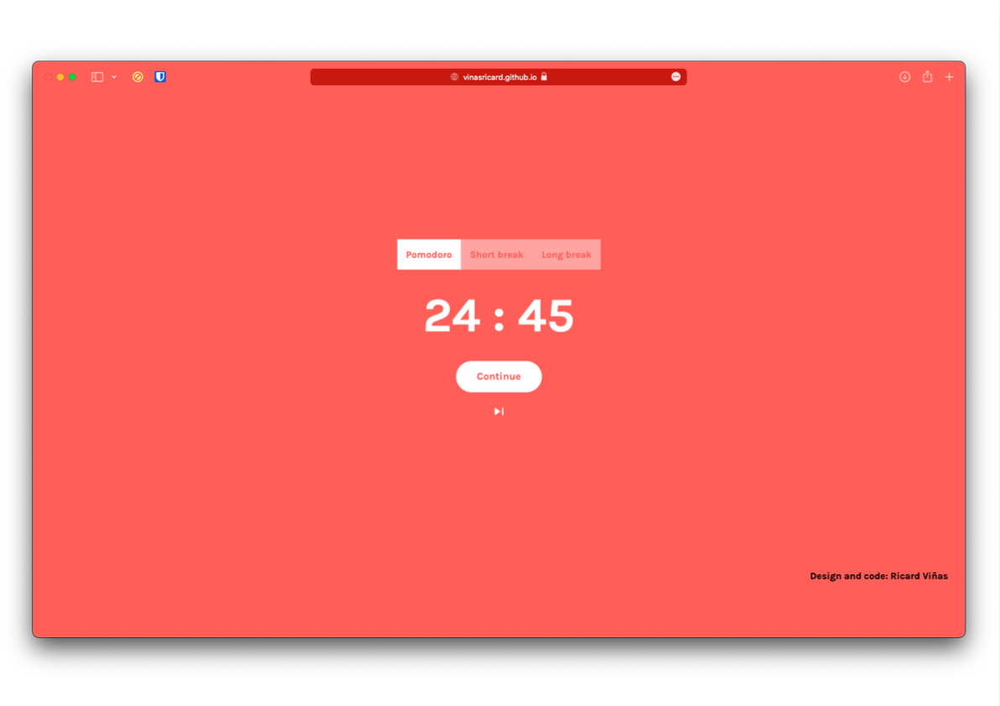

<h1 align="center"><a href="https://vinasricard.github.io/PomodoroTimer/" target="blank">Pomodoro Timer Web APP</a></h1>
<h3 align="center">This is a simple web app that allows the user to track blocks of 25, 15 and 5 minutes for the Pomodoro technique.</h3>
<h3 align="center">The Pomodoro technique is a time managemend tool to improve productivity. It is very simple, just divide your time in 25 minutes sessions of work and rest 5 minutes between sessions; After 4 sessions people recommend resting for 15 minutes. Just press start and focus on what matters.</h3>
<h3 align="center">Built with HTML, CSS and JavaScript</h3>
 

